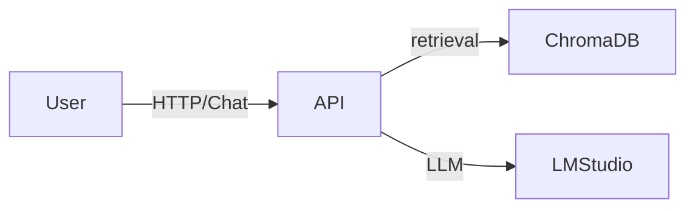

# RAG EasyStrat PoC
> Prototype pour explorer la génération augmentée par récupération sur des documents CRM.


## Sommaire
- [À propos](#à-propos)
- [Fonctionnalités](#fonctionnalités)
- [Prise-en-main rapide](#prise-en-main-rapide)
- [Installation détaillée](#installation-détaillée)
- [Exemples d'utilisation](#exemples-dutilisation)
- [Architecture](#architecture)
- [Roadmap](#roadmap)
- [Contribuer](#contribuer)
- [Tests](#tests)
- [License](#license)
- [Contact](#contact)
- [Crédits](#crédits)

## À propos
Ce dépôt contient un **proof of concept** de système RAG (Retrieval Augmented Generation). Il permet d'ingérer des documents métier au format DOCX puis d'interroger le contenu via une API ou un chatbot Chainlit.

## Fonctionnalités
- 🔹 API FastAPI pour interroger le RAG et téléverser des fichiers
- 🔹 Interface conversationnelle Chainlit avec affichage des sources
- 🔹 Stockage vectoriel local ChromaDB
- 🔹 Embeddings `all-MiniLM-L6-v2` et rerank par cross-encoder

## Prise-en-main rapide
```bash
# Cloner puis installer les dépendances
pip install -r requirements.txt

# Lancer l'API
uvicorn api.app:app --reload
```

## Installation détaillée
1. Python 3.12 recommandé
2. `pip install -r requirements.txt`
3. Démarrage de l'API : `uvicorn api.app:app --reload`
4. Démarrage de l'UI Chainlit : `chainlit run api/chainlit_app.py`

## Exemples d'utilisation
Interrogez l'API :
```bash
curl -X POST http://localhost:8000/query \
  -H "Content-Type: application/json" \
  -d '{"question": "Quel est le principal obstacle aux systèmes hérités ?"}'
```

## Architecture


## Roadmap
- [ ] Ajout d'un script d'ingestion en ligne de commande
- [ ] Support PDF

## Contribuer
Les contributions sont bienvenues ! Ouvrez une *issue* ou une *pull request* pour proposer vos améliorations.

## Tests
Lancez la suite de tests avec `pytest`.

## License
Distribué sous licence MIT. Voir le fichier [LICENSE](LICENSE).

## Contact
Lilian — [LinkedIn](https://www.linkedin.com/in/lilian-serre)

## Crédits
Inspiré des travaux open-source autour du RAG et de la communauté Chainlit.
